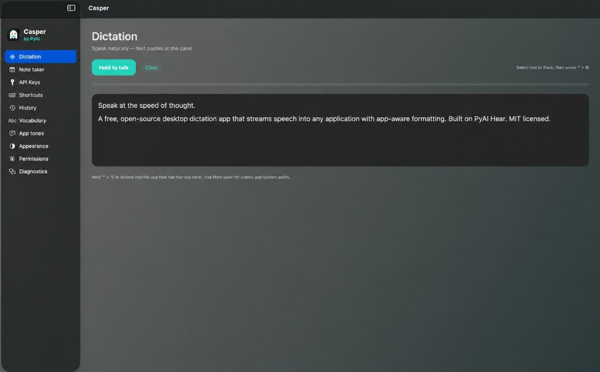
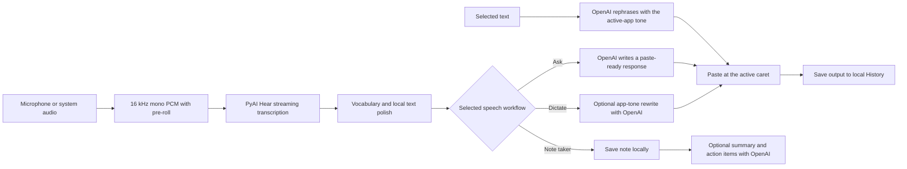

# Casper

Speak naturally and paste polished text into any macOS app.

Casper is a free, open-source macOS voice productivity app. It streams speech to **PyAI Hear**, shows live transcription in a floating HUD, and inserts the result at the current text caret. Vocabulary correction and lightweight app-aware tone rules run locally. An optional **OpenAI** key adds spoken writing requests, selection rephrasing, fuller LLM tone rewrites, and note summaries with action items.

[Download the latest release](https://github.com/arsalan-saaslabs/CasperFlow/releases) · [Build from source](#run-from-source-on-a-fresh-mac) · [Report an issue](https://github.com/arsalan-saaslabs/CasperFlow/issues)

Current version: **0.2.4** · License: [MIT](LICENSE) · Platform: **macOS 14+**



*Casper's Dictation workspace combines hold-to-talk controls, a live transcript, input level, status, and quick access to every app section.*

## Contents

- [Core workflows](#core-workflows)
- [Features in detail](#features-in-detail)
- [Install a release](#install-a-release)
- [Run from source on a fresh Mac](#run-from-source-on-a-fresh-mac)
- [First-run setup](#first-run-setup)
- [Security and privacy](#security-and-privacy)
- [Troubleshooting](#troubleshooting)

## What Casper can do

- **Dictate anywhere:** speak into Slack, Mail, Chrome, Cursor, Notes, and other apps without moving focus away from the text field.
- **Ask ChatGPT by voice:** speak a writing request and paste the generated answer into the active app.
- **Rephrase a selection:** select text in another app, run the shortcut, and replace it in the active app's tone; General is used when the profile says Do nothing.
- **Take notes:** transcribe a microphone, system audio, or both; then summarize, extract action items, copy the transcript or insights, or export the complete note.
- **Reuse previous output:** filter, save, drag, delete, or paste entries from local Dictate, Ask, and Rephrase history.
- **Teach personal vocabulary:** map Hear's spelling to names, acronyms, and domain terminology.
- **Choose a tone per app:** Casual, Professional, Developer, General, or Do nothing.
- **Work from anywhere:** use global shortcuts, the floating command overlay, the history overlay, or the menu bar.
- **Customize the app:** change every shortcut, choose hold/toggle talk style, and use System, Light, or Dark appearance.
- **Diagnose failures:** review sanitized local logs and restart or dismiss a failed voice action.

## Requirements by workflow

| Workflow | PyAI key | OpenAI key | Accessibility | Microphone | Screen Recording |
|---|---:|---:|---:|---:|---:|
| Dictate and paste | Required | Optional for LLM tone rewrite | Required | Required | No |
| Ask ChatGPT by voice | Required | Required | Required | Required | No |
| Rephrase selected text | No | Required | Required | No | No |
| Note taker: microphone | Required | Optional for insights | Only for the global shortcut | Required | No |
| Note taker: system audio | Required | Optional for insights | Only for the global shortcut | No | Required |
| Note taker: mic + system | Required | Optional for insights | Only for the global shortcut | Required | Required |
| Paste an item from History | No | No | Required | No | No |

You also need an internet connection that can reach `api.pyai.com`. OpenAI-backed actions additionally need access to `api.openai.com`.

## Core workflows

### 1. Dictate into another app

1. Put the caret in the destination app.
2. Hold **Control + Option** (or use your configured talk style and shortcut).
3. Speak while the non-activating HUD shows live partial text, current activity, active app, and tone.
4. Casper polishes and pastes each finalized utterance as it arrives. Eligible chunks can optionally receive an OpenAI tone rewrite before insertion.
5. Release the shortcut to commit any remaining partial text and end the action. Each successfully pasted chunk is added to local Dictate history.

The main Casper window also has a **Hold to talk** button. While that window is focused, Space can start the same action.

### 2. Ask ChatGPT by voice

1. Put the caret where the response should be inserted.
2. Hold **Option + Command** and speak the request.
3. Casper transcribes the request with PyAI, sends the transcript to OpenAI, formats the response for the active app, and pastes it at the caret.
4. The response is added to Ask history.

This flow requires both API keys. Dictate and Ask share the **Hold to talk** or **Press to start / press to stop** preference.

### 3. Rephrase selected text

1. Select text in the target app.
2. Press **Control + Command**.
3. Casper copies the selection, rewrites it with OpenAI using the active app's tone—using General when that profile is set to Do nothing—and replaces the selection.
4. The replacement is added to Rephrase history.

The clipboard is restored after Casper reads or inserts text. Explicit Rephrase still uses OpenAI when automatic tone rephrasing is disabled. It requires Accessibility and an OpenAI key, but it does not use PyAI or the microphone.

### 4. Capture and review notes

1. Open **Note taker**, the menu bar panel, or the command overlay.
2. Choose **Microphone**, **System audio**, or **Mic + system**.
3. Start capture. Casper uses longer speech endpointing for meetings and videos and keeps the transcript inside the app instead of pasting it.
4. Stop capture to save the note locally.
5. Optionally use OpenAI to generate a short summary and action items.
6. Copy the transcript, copy or refresh insights separately, or export the complete note as Markdown or plain text.

System-audio capture uses ScreenCaptureKit. Screen Recording permission is required by macOS, but Casper discards video frames and does not save screen video.

Casper retains the newest 80 notes on this Mac.

### 5. Reuse History

Dictate, Ask, and Rephrase results are stored locally. Open **History** in the app or press **Control + Shift + H** to use the movable overlay. You can:

- filter by All, Saved, Dictate, Ask ChatGPT, or Rephrase;
- bookmark items so they are retained;
- drag text into another app;
- paste an item at the active caret;
- delete one item or clear all unsaved items.

Casper retains the newest 80 unsaved entries; saved entries are not removed by that limit.

## How speech becomes text



PyAI receives audio for Dictate, Ask, and Note taker. OpenAI receives text only when an OpenAI-backed action is used: Ask ChatGPT, selection rephrase, LLM tone rewrite, or note insights.

When an OpenAI key is saved and automatic tone rephrasing is enabled, each eligible Dictate chunk is sent to OpenAI unless the active app profile uses **Do nothing**.

## Features in detail

### Vocabulary and text cleanup

Vocabulary entries are case-insensitive **heard as → replacement** rules. Personal terms override Casper's built-in aliases and apply to both streaming HUD text and committed output. You can store up to 200 terms, with up to 80 characters on each side of a rule.

Local processing also handles common jargon, filler removal for notes, spelling, capitalization, punctuation, and lightweight tone rules. The Developer tone deliberately skips general spell correction.

### Per-app writing tones

| Profile shown in Casper | Apps matched | Default tone |
|---|---|---|
| Slack | Slack | Casual |
| Mail | Mail, Outlook, Spark | Professional |
| Cursor | Cursor | Developer |
| Visual Studio Code | Visual Studio Code | Developer |
| Google Chrome | Chrome | General |
| Safari | Safari | General |
| Notes | Notes, Notion, Obsidian | General |
| Other apps | Unmatched applications | General |

Each profile can be changed to **Do nothing**, **Casual**, **Professional**, **Developer**, or **General**. Turning tone rephrasing off still keeps vocabulary cleanup. **Do nothing** applies vocabulary corrections but skips local spelling/punctuation formatting and both local and OpenAI tone rewriting.

### Shortcuts

Every shortcut is configurable. Modifier-only chords and single keys are supported, duplicate assignments are rejected, and Escape cancels shortcut recording.

| Default | Action |
|---|---|
| **Control + Option** | Dictate into the focused app |
| **Option + Command** | Ask ChatGPT and paste the response |
| **Control + Command** | Rephrase the current selection |
| **Control + Shift + H** | Show or hide the History overlay |
| **Control + Shift + N** | Start or stop Note taker |
| **Control + Shift + O** | Show or hide the command overlay |
| Space or **Hold to talk** | Dictate while the Casper window is focused |

### Menu bar and overlays

The menu bar panel can start or stop Dictate, Ask, and Note taker; rephrase a selection; open History or the command overlay; choose the note audio source and active-app tone; pause all global actions; recover from an error; open logs; show the main window; or quit.

The command overlay exposes the main actions and tone chips without leaving the current app. The floating Dictation HUD and History overlay are non-activating panels, so they do not steal the text caret.

### App sections

| Section | Purpose |
|---|---|
| **Dictation** | Hold-to-talk controls, live transcript, level meter, and recovery actions |
| **Note taker** | Capture mic/system audio, browse notes, generate insights, copy transcript/insights, export, and delete |
| **API Keys** | Configure the required PyAI key and optional OpenAI key |
| **Shortcuts** | Choose talk style and record/reset every global shortcut |
| **History** | Filter, save, drag, paste, and remove previous output |
| **Vocabulary** | Add, edit, and delete personal spelling rules |
| **App tones** | Enable tone rewriting and assign a tone to each app profile |
| **Appearance** | Follow macOS or force Light/Dark mode |
| **Permissions** | Check trust status and open the relevant System Settings pages |
| **Diagnostics** | Inspect, copy, reveal, or email sanitized local logs |

## Install a release

1. Download the latest `Casper-*.dmg` from [GitHub Releases](https://github.com/arsalan-saaslabs/CasperFlow/releases).
2. Open the disk image and drag **Casper** into **Applications**.
3. Launch Casper from `/Applications`, not from the mounted disk image.
4. If Gatekeeper blocks the ad-hoc-signed build, right-click **Casper** and choose **Open**.
5. Grant the permissions described in [First-run setup](#first-run-setup).
6. Open **API Keys** in Casper and save your PyAI key. Add an OpenAI key if you want OpenAI-backed features.

End users do not need to clone the repository or run a script.

## Run from source on a fresh Mac

### Prerequisites

- macOS 14 Sonoma or later
- Git
- Xcode 15+ **or** Apple command-line tools that provide Swift 5.9+
- A PyAI API key with `hear:stream` access
- An OpenAI API key only if you want OpenAI-backed features

There are no third-party Swift package dependencies, database migrations, containers, background services, or seed steps.

### 1. Install and verify the toolchain

Install Apple's command-line tools if Swift is not already available:

```bash
xcode-select --install
```

After the installer finishes, verify the tools:

```bash
xcode-select -p
swift --version
git --version
```

`swift --version` must report Swift 5.9 or newer.

### 2. Clone the repository

```bash
git clone https://github.com/arsalan-saaslabs/CasperFlow.git
cd CasperFlow
```

### 3. Build, install, and launch the supported app bundle

```bash
./run.sh
```

`run.sh` will:

1. build a release binary when the app is missing or Swift source files changed;
2. create an ad-hoc-signed bundle at `dist/Casper.app`;
3. replace the source-build installation at `~/Applications/Casper.app`;
4. stop an older `CasperFlow` process; and
5. launch the installed app bundle.

When a build is needed, the packaging script also removes the legacy `~/Applications/CasperFlow.app` path before installing `Casper.app`.

Use `./run.sh` for interactive testing. `./build-app.sh` only builds and installs the bundle, so follow it with `open "$HOME/Applications/Casper.app"` when you need to force a reinstall. Do **not** use `swift run` for normal app testing: global shortcuts and Accessibility approval must attach to the stable `com.casperflow.app` bundle.

If you changed `Package.swift`, a build script, `Resources/Info.plist`, icons, or other non-Swift resources, force a rebuild and reinstall:

```bash
./build-app.sh
open "$HOME/Applications/Casper.app"
```

## First-run setup

1. Open **API Keys** and save the PyAI key. Save an OpenAI key if needed.
2. Open **Permissions** and grant **Accessibility** to the exact app that is running:
   - source build: `~/Applications/Casper.app`
   - DMG/release install: `/Applications/Casper.app`
3. Grant **Microphone** when prompted for Dictate, Ask, or microphone notes.
4. To enable **Screen Recording**, choose **System audio** or **Mic + system** and start Note taker once. Grant the macOS prompt, restart Casper if requested, and retry the capture.
5. Return to Casper's **Permissions** section and refresh the trust state if global shortcuts remain inactive.
6. Put the caret in TextEdit or another text field and perform a short Dictate smoke test.

Do not grant Accessibility to Terminal, Cursor, the `dist/` copy, or a mounted DMG when you intend to run the installed Casper app.

## Optional PyAI environment fallback

The recommended configuration is the in-app **API Keys** screen. For local development, Casper can also read `PYAI_API_KEY` from a repository-root `.env` file:

```bash
cp .env.example .env
```

Then set only:

```dotenv
PYAI_API_KEY=your_key_here
```

`.env` is ignored by Git. The current source loader does not read `OPENAI_API_KEY` from `.env`; configure OpenAI in the app.

## Build and validation commands

```bash
# Compile without packaging or launching
swift build

# Compile an optimized binary
swift build -c release

# Force package, sign, and install ~/Applications/Casper.app
./build-app.sh

# Package if needed, then launch the supported bundle
./run.sh

# Validate shell syntax and the app property list
for script in run.sh build-app.sh create-dmg.sh; do bash -n "$script"; done
plutil -lint Resources/Info.plist
```

The package currently has no automated test target or configured linter. A successful Swift build plus manual permission, Dictate, paste, and Note taker smoke tests are the current validation path.

## Build a DMG

```bash
./create-dmg.sh
```

The script first runs `build-app.sh`, which also replaces `~/Applications/Casper.app`, then stages a drag-to-Applications image and writes:

- `dist/Casper-<version>.dmg`
- `dist/Casper.dmg` as a convenience symlink

The local DMG is ad-hoc signed, not Developer ID signed or notarized. Distribution without the right-click **Open** step requires an Apple Developer identity and notarization outside the current scripts.

## Security and privacy

- **No shell integration:** Casper does not invoke a shell, launch terminal commands, or synthesize the Return key. It only inserts or pastes plain text into the currently focused UI element. Terminal apps are not currently blocked, so text can be pasted at a terminal prompt if one is focused; always verify the target before using a voice action.
- **Local persistence:** History, notes, vocabulary, preferences, API keys, and diagnostics stay on the Mac. Casper does not provide cloud sync for this stored data.
- **Defined network boundaries:** Voice audio is streamed to PyAI Hear for transcription. Text is sent to OpenAI only for configured OpenAI-backed features such as Ask ChatGPT, Rephrase, LLM tone rewriting, and note insights.
- **No audio or screen recordings:** Microphone and system audio are processed in memory rather than saved as media files. ScreenCaptureKit video frames are discarded; only system audio is used.
- **Clipboard restoration:** Casper prefers direct Accessibility insertion. If it must use copy/paste, it snapshots the existing clipboard and restores it after the operation.
- **Credential-aware diagnostics:** API keys are kept in local app preferences and are not intentionally written to logs. Diagnostic output removes common API-key and bearer-token patterns before it is displayed, copied, or emailed.

### Local storage map

| Data | Storage or destination |
|---|---|
| API keys, appearance, shortcuts, tones | macOS `UserDefaults` for Casper |
| History | `~/Library/Application Support/CasperFlow/history.json` |
| Notes | `~/Library/Application Support/CasperFlow/notes.json` |
| Vocabulary | `~/Library/Application Support/CasperFlow/vocabulary.json` |
| Diagnostics | `~/Library/Application Support/CasperFlow/casperflow.log` |
| Voice audio | Streamed to PyAI Hear for transcription |
| OpenAI-backed text | Sent to OpenAI only for the selected OpenAI feature |

Keys saved in the app are stored in local `UserDefaults`, not Keychain. The optional `.env` fallback also stays local and is ignored by Git.

## Troubleshooting

### Global shortcuts or paste do not work

- Confirm the exact running Casper app is enabled in **System Settings → Privacy & Security → Accessibility**.
- For source builds, enable `~/Applications/Casper.app`; for releases, enable `/Applications/Casper.app`.
- If the toggle looks enabled but Casper still reports that it is untrusted, remove the old entry, add the exact installed app again, and refresh the **Permissions** section.
- Focus a writable text field before Dictate, Ask, History paste, or Rephrase.

### PyAI Hear is unavailable

- Confirm the PyAI key in **API Keys** is non-empty and authorized for Hear streaming.
- Check that the network can reach `api.pyai.com` over HTTPS/WSS.
- Use **Restart** in the error banner or menu bar after correcting the problem.

### Ask, Rephrase, tone rewrite, or note insights fail

- Add or replace the OpenAI key in **API Keys**.
- Check that the network can reach `api.openai.com`.
- Keep Ask and selection/tone rewrite inputs at or below 2,000 characters; note insights accept transcripts up to 24,000 characters.
- Dictate can continue with local tone rules if OpenAI rewriting is unavailable.

### System-audio notes are empty

- Enable Casper under **System Settings → Privacy & Security → Screen Recording**.
- Restart Casper after changing the permission.
- Choose **System audio** or **Mic + system** before starting Note taker.

### A resource change is not visible

`run.sh` automatically checks Swift source freshness. After changing `Package.swift`, build scripts, icons, `Info.plist`, or other resources, run `./build-app.sh` to force the bundle to be recreated and installed.

## Project structure

```text
CasperFlow/
├── Package.swift                  # SwiftPM executable and macOS 14 target
├── Sources/CasperFlow/
│   ├── App/                       # Settings, hotkeys, paste, local stores
│   ├── Audio/                     # Microphone/system capture and PCM processing
│   ├── Hear/                      # PyAI health check and streaming WebSocket client
│   ├── Session/                   # DictationSession state machine and workflow coordinator
│   ├── Text/                      # Local cleanup and OpenAI-backed text actions
│   └── UI/                        # Main window, menu bar, HUDs, overlays, and sections
├── Resources/                     # Info.plist, icons, and brand assets
├── docs/screenshots/              # Documentation images
├── run.sh                         # Build if needed and launch installed source app
├── build-app.sh                   # Build, bundle, sign, and install Casper.app
└── create-dmg.sh                  # Create the local distribution image
```

CasperFlow is the macOS client only. Speech-to-text is provided by the hosted PyAI Hear API.

## License

Casper is released under the [MIT License](LICENSE).
