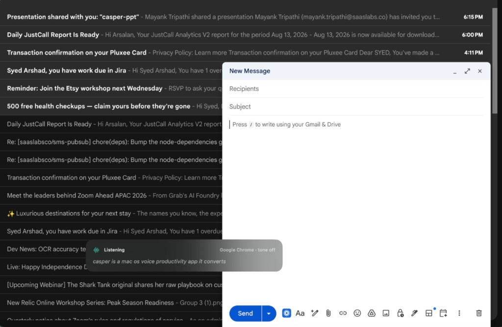

# CasperFlow

Open-source macOS dictation: hold **Ctrl+Option**, speak, and polished text pastes into the focused app.

Powered by **PyAI Hear** (speech-to-text) with optional **OpenAI** tone rephrasing. MIT licensed.




```
Mic → 16 kHz PCM16 → pre-roll → Hear stream
  → local lexicon + app-aware tone
  → optional OpenAI rewrite (dictate) or ChatGPT compose (Ask)
  → paste at caret (any app)
```

## Requirements

- macOS 14+
- Xcode 15+ / Swift 5.9+
- `PYAI_API_KEY` with `hear:stream` scope
- Optional: `OPENAI_API_KEY` for LLM tone rewrite

## Install (recommended)

Download the latest `Casper-*.dmg` from [Releases](https://github.com/arsalan-saaslabs/CasperFlow/releases).

1. Open the DMG and drag **CasperFlow** into **Applications**
2. Launch it from Applications (not from the disk image)
3. If macOS says the app is from an unidentified developer: right-click → **Open**
4. Grant **Microphone** and **Accessibility** for CasperFlow
5. In the app, open **API Keys** and save your PyAI key (OpenAI is optional)

No clone, no `./run.sh`.

### Build a DMG yourself

```bash
./create-dmg.sh
```

Output: `dist/Casper-0.2.4.dmg`

## Run from source

```bash
./run.sh
```

Then open **API Keys** in the app and save your PyAI key (OpenAI is optional). A `.env` file is **not required**.

This builds the app, installs `~/Applications/Casper.app`, and launches that copy (required for Accessibility / global hotkey).

Always use `./run.sh` or `./build-app.sh` — not `swift run`. Enable **only Casper** in **~/Applications** (bundle `com.casperflow.app`), not Cursor and not `dist/Casper.app`. Rebuilds keep the same bundle id, so that Accessibility toggle should stay valid.

## App sections

| Section | Purpose |
|---------|---------|
| **Dictation** | Status, hold-to-talk, live transcript |
| **API Keys** | PyAI (required) + OpenAI (optional) |
| **Shortcuts** | Assign keys for Dictate, Ask ChatGPT, Rephrase, and History |
| **History** | Task log — save, drag into any app, or paste |
| **App tones** | Per-app Do nothing / Casual / Professional / Developer / General |
| **Appearance** | System / Light / Dark |
| **Permissions** | Accessibility + microphone |

## Controls

Defaults (change any of these in **Shortcuts**):

| Default | Action |
|---------|--------|
| **Ctrl+Option** (hold) | Dictate → paste into focused app |
| **Option+Command** (hold) | Ask ChatGPT → paste reply |
| **Ctrl+Command** (tap) | Rephrase selected text |
| **Ctrl+Shift+H** (tap) | Show / hide history overlay |
| Space / on-screen button | Dictate while CasperFlow is focused |

Enable **~/Applications/Casper.app** (`com.casperflow.app`) under System Settings → Privacy & Security → Accessibility — not Cursor, not the Desktop `dist` copy.

A **menu bar icon** (waveform) stays in the top-right of the screen. From there you can enable/disable hotkeys, open the window, or quit.

## What is included

This repository is the **macOS Swift app only**.

## License

MIT — see [LICENSE](LICENSE).
